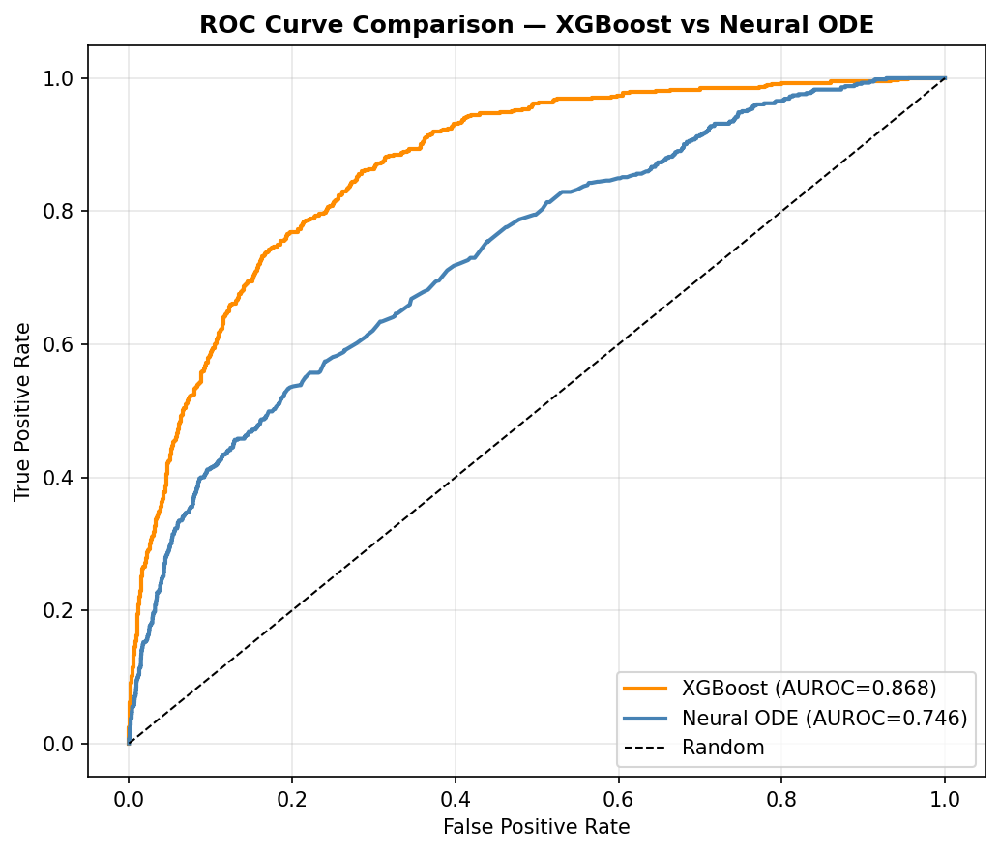
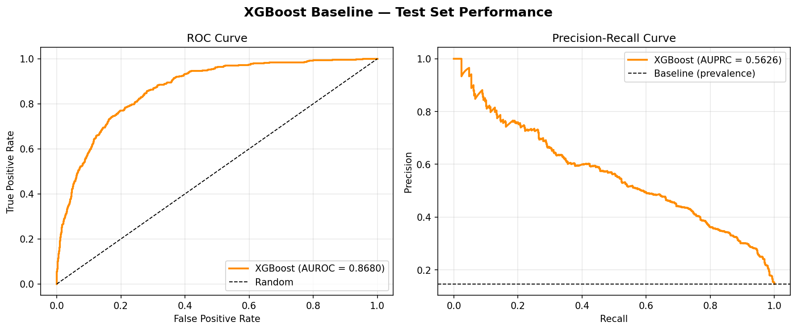
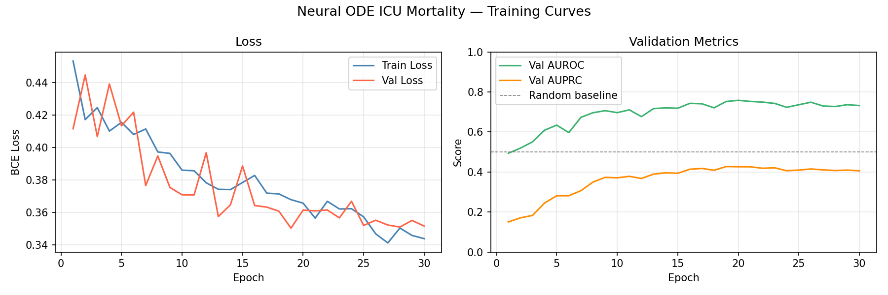
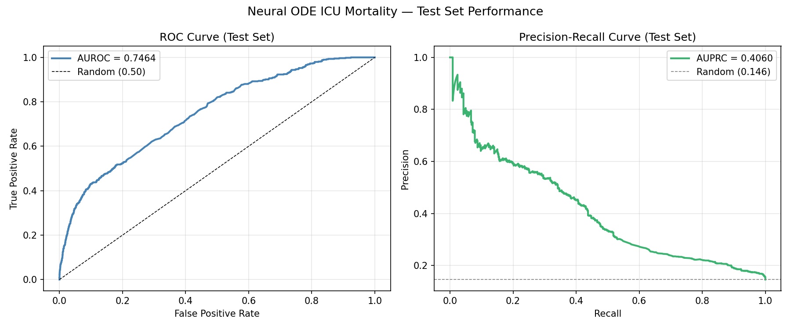

# Neural ODE for ICU Mortality Prediction

Applying Latent ODEs to irregular clinical time series from the PhysioNet 2012 Challenge dataset to predict in-hospital mortality.

## Motivation

ICU patient data is naturally irregular — vitals and labs are recorded at uneven intervals, and patients have vastly different observation patterns. Standard RNNs struggle with this. Neural ODEs model the underlying continuous-time dynamics directly, making them a natural fit for clinical time series.

This project implements the Latent ODE architecture from [Rubanova et al. (2019)](https://arxiv.org/abs/1907.03907), building on the foundational Neural ODE work of [Chen et al. (2018)](https://arxiv.org/abs/1806.07366), applied to ICU mortality prediction.

## Results

### Model Comparison

| Model | Test AUROC | Test AUPRC | Notes |
|-------|-----------|-----------|-------|
| XGBoost (367 features) | **0.8680** | **0.5626** | Feature engineering + gradient boosting |
| Neural ODE — Run 1 | 0.7464 | 0.4060 | latent-dim 32, hidden-dim 64, 30 epochs |
| Neural ODE — Run 2 | 0.7387 | 0.3929 | latent-dim 64, hidden-dim 128, 50 epochs |
| Neural ODE — Run 3 | 0.7377 | 0.3774 | latent-dim 32, hidden-dim 64, early stopping |
| SAPS-II (clinical baseline) | ~0.74 | — | Rule-based severity score used in practice |
| 2012 Challenge winners | ~0.85 | — | Feature engineering + ensembles |

**Key finding:** On 12k patients, traditional feature engineering + XGBoost significantly outperforms the Neural ODE (~0.87 vs ~0.75 AUROC). This is consistent with the 2012 challenge results and reflects a data scale effect — Neural ODEs are better suited to larger datasets where their continuous-time dynamics can fully generalize. The next step is scaling to MIMIC-IV (~50-70k patients) to test this hypothesis.

### ROC Curve Comparison — XGBoost vs Neural ODE


### XGBoost Baseline — ROC & Precision-Recall


### Neural ODE Training Curves — Run 2


### Neural ODE ROC & Precision-Recall — Run 2


### Neural ODE Run Details

| Run | latent-dim | hidden-dim | Stopped at | Best Val AUROC |
|-----|-----------|-----------|-----------|---------------|
| 1 | 32 | 64 | Epoch 30 | 0.7524 (ep 21) |
| 2 | 64 | 128 | Epoch 50 | 0.7686 (ep 19) |
| 3 | 32 | 64 | Epoch 28 (early stop) | 0.7461 (ep 14) |

## Dataset

**PhysioNet Computing in Cardiology Challenge 2012**
- 12,000 ICU patients (sets A, B, C)
- 3,994 train / 3,992 val / 3,995 test split
- 48-hour observation window
- 37 irregularly sampled clinical variables (HR, GCS, RespRate, Lactate, etc.)
- 13.9% mortality rate (class imbalance handled via `pos_weight=6.2x`)
- Open access: https://physionet.org/content/challenge-2012/1.0.0/

## Model Architecture

```
Observations (irregular) --> GRU Encoder (backwards) --> z0 ~ N(mean, var)
                                                              |
                                                    Neural ODE (dopri5)
                                                    dz/dt = MLP(z)
                                                              |
                                                    z_final (t = 48h)
                                                              |
                                                    Decoder --> Mortality logit
```

- **Encoder**: GRU processes `[values, mask]` pairs in *reverse* time order to produce a distribution over the initial latent state z0. The mask (1=observed, 0=missing) is concatenated with values to handle irregular/missing measurements explicitly.
- **Latent ODE**: The ODE function `dz/dt = f(z)` is a 3-layer MLP with Tanh activations, solved from t=0 to t=48h using the adaptive `dopri5` solver via `torchdiffeq`.
- **Reparameterization**: z0 is sampled from a Gaussian (VAE-style) during training for uncertainty quantification. At inference, the mean is used directly for deterministic predictions.
- **Decoder**: Two-layer MLP maps the final latent state to a mortality logit.
- **Loss**: Binary cross-entropy (with class `pos_weight`) + KL divergence regularizer on z0.

## Project Structure

```
neural-ode-icu/
├── src/
│   ├── dataset.py      # Data loading, preprocessing, PhysioNetDataset
│   ├── model.py        # GRUEncoder, ODEFunc, LatentODE
│   ├── train.py        # Training loop, eval, checkpoint/resume, early stopping
│   ├── baseline.py     # XGBoost baseline (367 hand-crafted features)
│   ├── plot_results.py # Neural ODE training curves + ROC/PR curves
│   └── plot_baseline.py # XGBoost ROC/PR + combined model comparison plot
├── results/
│   ├── training_curves.png
│   ├── test_performance.png
│   └── checkpoints/    # best_model.pt + latest_model.pt (not committed)
├── data/
│   ├── raw/            # PhysioNet 2012 files (not committed)
│   └── processed/      # train/val/test.pkl + normalisation stats (not committed)
├── TRAINING_NOTES.md   # Lessons learned, known issues, useful commands
└── requirements.txt
```

## Setup

```bash
pip install -r requirements.txt

# For GPU (recommended — CUDA 12.x)
pip install torch --index-url https://download.pytorch.org/whl/cu124
```

## Usage

```bash
# Preprocess data (after downloading PhysioNet 2012 sets A/B/C)
python src/dataset.py

# Train (with early stopping)
python src/train.py --epochs 50 --batch-size 64 --latent-dim 32 --early-stop-patience 10

# Resume interrupted run
python src/train.py --epochs 50 --batch-size 64 --latent-dim 32 --early-stop-patience 10 --resume

# Run XGBoost baseline
python src/baseline.py

# Plot results
python src/plot_results.py
```

## Key Implementation Notes

- **Missing data**: Mask vector concatenated to encoder input — no imputation needed.
- **AMP disabled**: `torch.autocast` breaks dopri5's adaptive step-size controller (fp16 error estimates cause the solver to take excessive micro-steps). Training runs in fp32.
- **Windows**: `num_workers=0` required for DataLoader — Windows multiprocessing with `spawn` causes recursive worker explosion without `if __name__ == '__main__'` guards.
- **Class imbalance**: `BCEWithLogitsLoss(pos_weight=6.2x)` for the 13.9% mortality rate.
- See `TRAINING_NOTES.md` for full lessons-learned log.

## References

- Rubanova, Y., Chen, T. Q., & Duvenaud, D. (2019). [Latent ODEs for Irregularly-Sampled Time Series.](https://arxiv.org/abs/1907.03907) NeurIPS 2019.
- Chen, T. Q., Rubanova, Y., Bettencourt, J., & Duvenaud, D. (2018). [Neural Ordinary Differential Equations.](https://arxiv.org/abs/1806.07366) NeurIPS 2018. *(Best Paper Award)*
- PhysioNet Challenge 2012: https://physionet.org/content/challenge-2012/
