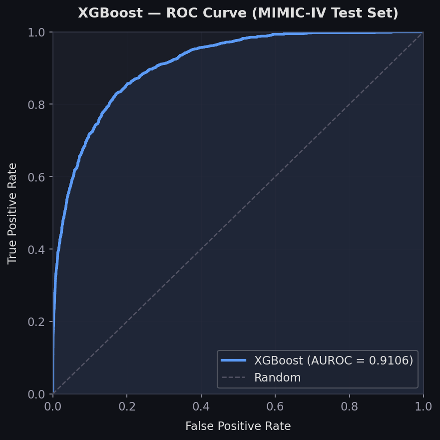

# Neural ODE for ICU Mortality Prediction

Comparing structured time-series models (XGBoost, Neural ODE) against clinical NLP (ClinicalBERT) for in-hospital mortality prediction on MIMIC-IV ICU data. Trained on MSU's Tempest HPC cluster.

## Motivation

ICU patient data is naturally irregular — vitals and labs are recorded at uneven intervals, and patients have vastly different observation patterns. Standard RNNs struggle with this. Neural ODEs model underlying continuous-time dynamics directly, making them a natural fit for clinical time series.

This project implements the Latent ODE architecture from [Rubanova et al. (2019)](https://arxiv.org/abs/1907.03907), building on [Chen et al. (2018)](https://arxiv.org/abs/1806.07366), and compares it against XGBoost feature engineering and ClinicalBERT applied to clinical notes — all evaluated on the same MIMIC-IV cohort.

---

## Results

### MIMIC-IV (Main Results)

All models evaluated on an identical canonical test set (n=4,715, 11.4% mortality) with 2,000-iteration bootstrap 95% confidence intervals and DeLong significance testing.

| Model | Test AUROC | 95% CI | Test AUPRC | 95% CI | Input |
|-------|-----------|--------|-----------|--------|-------|
| **XGBoost** | **0.9565** | [0.9473, 0.9644] | **0.8269** | [0.7976, 0.8524] | Structured vitals (20 vars, 160 features) |
| **Neural ODE** | **0.9039** | [0.8907, 0.9164] | **0.6661** | [0.6292, 0.7013] | Structured vitals (20 vars, hourly 48h) |
| Multimodal (GRU + BERT) | 0.8858 | [0.8720, 0.8992] | — | — | Structured vitals + clinical notes (frozen BERT) |
| BERT (notes) | 0.8809 | [0.8661, 0.8947] | 0.5387 | [0.4916, 0.5839] | First-48h nursing/physician notes |

**Statistical significance:** All pairwise differences are significant (non-overlapping CIs). XGBoost vs Neural ODE: DeLong z=11.22, p < 0.0001.

**Key findings:**
- Structured time-series models significantly outperform text-based approaches at every comparison
- Feature-engineered XGBoost (0.9565) dominates all neural approaches — careful statistical summaries of vitals capture more signal than continuous-time modeling on this dataset
- Multimodal fusion (GRU + frozen BERT) marginally outperforms BERT alone (+0.005) but falls well short of Neural ODE on structured data alone — clinical notes add minimal complementary signal beyond what vitals already capture
- The structured-vs-text performance gap persists even when fusing both modalities, suggesting future work should focus on better time-series architectures or larger language models (LoRA fine-tuning of 7B+ models)

#### ROC Curve Comparison (95% CI)


#### AUROC with Bootstrap 95% CI


#### XGBoost — ROC Curve


#### XGBoost — Top 20 Feature Importances
GCS subscores dominate, consistent with clinical intuition — neurological status is the strongest predictor of ICU mortality.


#### Neural ODE — ROC Curve


---

### PhysioNet 2012 (Initial Validation)

Initial experiments on the PhysioNet 2012 Challenge dataset (12k patients, 37 variables) confirmed the data-scale hypothesis: Neural ODE performance was limited by dataset size, motivating the move to MIMIC-IV.

| Model | Test AUROC | Test AUPRC |
|-------|-----------|-----------|
| XGBoost (367 features) | 0.8680 | 0.5626 |
| Neural ODE (best run) | 0.7464 | 0.4060 |
| 2012 Challenge winners | ~0.85 | — |

The gap between XGBoost (0.868) and Neural ODE (0.746) on 12k patients largely closes on MIMIC-IV (74k patients): 0.9106 vs 0.8902. This confirms the data-scale hypothesis — Neural ODEs require more data to learn continuous-time dynamics effectively.

---

## Dataset

### MIMIC-IV (Primary)
- **74,829 ICU stays** (LOS ≥ 24h), MIMIC-IV v3.1
- **20 clinical variables**: heart rate, SBP, DBP, MBP, resp rate, temperature, SpO2, glucose, creatinine, sodium, potassium, hematocrit, WBC, bicarbonate, BUN, GCS motor/verbal/eye, urine output, age
- **Hourly binning**, 48-hour observation window, forward-fill imputation
- **11.9% mortality rate**
- **Clinical notes**: 47,142 stays with nursing/physician notes (first 48h, discharge summaries excluded to prevent leakage)
- Access via PhysioNet credentialed data use agreement

### PhysioNet 2012 (Initial)
- 12,000 ICU patients (sets A, B, C)
- 37 irregularly sampled clinical variables
- 13.9% mortality rate
- Open access: https://physionet.org/content/challenge-2012/1.0.0/

---

## Model Architecture

### Neural ODE (Latent ODE)

```
Observations (irregular) --> GRU Encoder (backwards) --> z0 ~ N(mean, var)
                                                               |
                                                     Neural ODE (dopri5)
                                                     dz/dt = MLP(z)
                                                               |
                                                     z_final (t = 48h)
                                                               |
                                                     Decoder --> Mortality logit
```

- **Encoder**: GRU processes `[values, mask]` pairs in reverse time order to produce a distribution over z0. The mask handles irregular/missing measurements without imputation.
- **Latent ODE**: `dz/dt = f(z)` solved via `dopri5` adaptive solver (torchdiffeq).
- **Reparameterization**: VAE-style sampling during training; mean used at inference.
- **Loss**: BCE (pos_weight for class imbalance) + KL divergence on z0.

### XGBoost Baseline
- 367 hand-crafted features per patient: mean, std, min, max, last value, missingness rate per variable
- Handles irregular sampling natively via aggregation

### ClinicalBERT (Notes)
- `emilyalsentzer/Bio_ClinicalBERT` fine-tuned on MIMIC-IV notes
- Input: concatenated first-48h nursing and physician notes (max 512 tokens)
- CLS token → linear classifier

### Multimodal Fusion
- GRU encoder (time series) → 64-dim latent
- ClinicalBERT (notes, frozen) → 768-dim CLS token
- Concat → FC(832→256) → ReLU → Dropout(0.5) → FC(256→64) → Dropout(0.3) → FC(64→1)
- Differential LRs: BERT 1e-5 (unused when frozen), GRU+head 1e-4
- Best val AUROC 0.8920 at epoch 22/25, no overfitting with frozen BERT
- Script: `src/mimic_train_multimodal.py`

---

## Project Structure

```
neural-ode-icu/
├── src/
│   ├── dataset.py                   # PhysioNet 2012 data loading
│   ├── model.py                     # GRUEncoder, ODEFunc, LatentODE
│   ├── train.py                     # PhysioNet training loop
│   ├── baseline.py                  # XGBoost baseline (PhysioNet)
│   ├── mimic_preprocess.py          # MIMIC-IV preprocessing pipeline
│   ├── mimic_dataset.py             # MIMIC-IV dataset class
│   ├── mimic_train_xgb.py           # XGBoost on MIMIC-IV
│   ├── mimic_train_ode.py           # Neural ODE on MIMIC-IV
│   ├── mimic_train_bert.py          # ClinicalBERT (vitals serialized)
│   ├── mimic_train_bert_notes.py    # ClinicalBERT (clinical notes)
│   ├── mimic_train_multimodal.py    # Multimodal fusion (ODE + BERT)
│   ├── mimic_prep_notes.py          # Notes preprocessing pipeline
│   ├── mimic_plot_xgb.py            # XGBoost plots
│   ├── mimic_plot_ode.py            # Neural ODE plots
│   └── mimic_plot_compare.py        # Multi-model comparison plots
├── results/
│   ├── plots/
│   │   ├── compare_roc.png          # 3-model ROC comparison
│   │   ├── compare_summary.png      # AUROC & AUPRC bar chart
│   │   ├── xgb_roc.png
│   │   ├── xgb_feature_importance.png
│   │   └── ode_roc.png
│   └── checkpoints/                 # Saved models (not committed)
├── data/                            # Not committed (credentialed access)
├── TRAINING_NOTES.md
└── requirements.txt
```

---

## Training Infrastructure

All MIMIC-IV experiments were run on **MSU Tempest HPC**:
- GPU: NVIDIA A40 (48GB VRAM)
- Environment: PyTorch 2.5.1+cu121, torchdiffeq, transformers==4.44.2
- Partition: `gpupriority` — account `priority-breschinecummins`
- Conda env: `neural-ode` (miniconda3)

Typical job submission:
```bash
sbatch --account=priority-breschinecummins --partition=gpupriority \
       --gres=gpu:1 --mem=32G --time=08:00:00 \
       --wrap="cd ~/neural-ode-icu && source ~/miniconda3/bin/activate neural-ode && python src/mimic_train_ode.py"
```

---

## Setup

```bash
pip install -r requirements.txt

# GPU (CUDA 12.x)
pip install torch --index-url https://download.pytorch.org/whl/cu121
pip install torchdiffeq transformers==4.44.2 xgboost scikit-learn
```

---

## Key Implementation Notes

- **Missing data**: Mask vector concatenated to encoder input — no imputation for Neural ODE; forward-fill for XGBoost/BERT.
- **AMP disabled**: `torch.autocast` breaks dopri5's adaptive step-size controller. All training in fp32.
- **transformers pinned to 4.44.2**: Newer versions block `torch.load` on PyTorch < 2.6 (CVE-2025-32434).
- **Notes leakage prevention**: Discharge summaries excluded via 48h time filter on `charttime`.
- **Class imbalance**: `BCEWithLogitsLoss(pos_weight)` scaled to mortality rate per dataset.

---

## References

- Rubanova, Y., Chen, T. Q., & Duvenaud, D. (2019). [Latent ODEs for Irregularly-Sampled Time Series.](https://arxiv.org/abs/1907.03907) *NeurIPS 2019.*
- Chen, T. Q., et al. (2018). [Neural Ordinary Differential Equations.](https://arxiv.org/abs/1806.07366) *NeurIPS 2018.* (Best Paper)
- Johnson, A., et al. (2023). MIMIC-IV: A freely accessible electronic health record dataset. *Scientific Data, 10*, 1.
- Alsentzer, E., et al. (2019). [Publicly Available Clinical BERT Embeddings.](https://arxiv.org/abs/1904.03323) *Clinical NLP Workshop @ NAACL.*
- Harutyunyan, H., et al. (2019). [Multitask learning and benchmarking with clinical time series data.](https://arxiv.org/abs/1703.07771) *Scientific Data, 6*, 96.
- Chen, T., & Guestrin, C. (2016). [XGBoost: A Scalable Tree Boosting System.](https://arxiv.org/abs/1603.02754) *KDD 2016.*
- Deznabi, I., et al. (2021). [Predicting In-Hospital Mortality by Combining Clinical Notes with Time-Series Data.](https://aclanthology.org/2021.findings-acl.352) *ACL Findings.*
