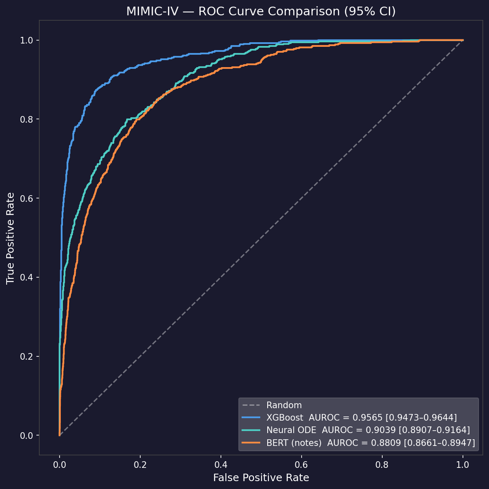
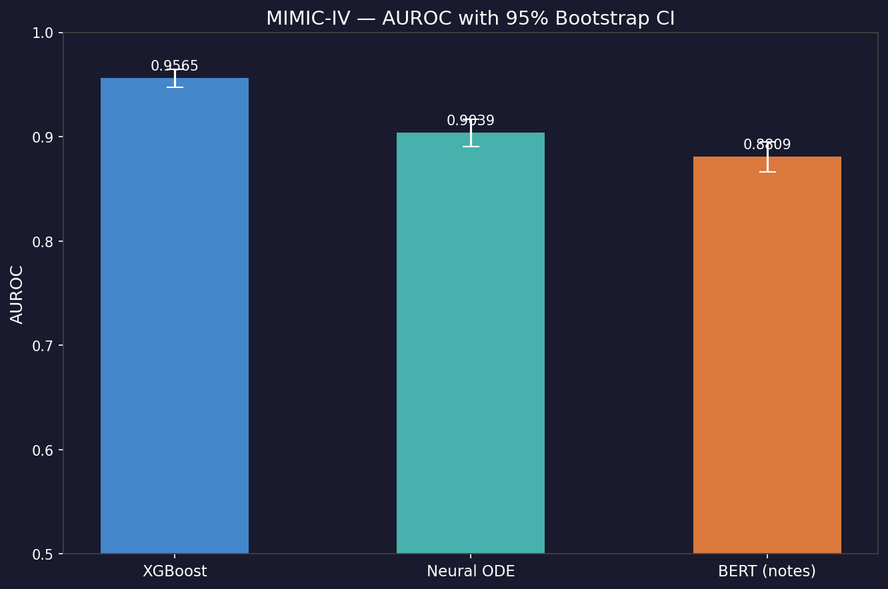
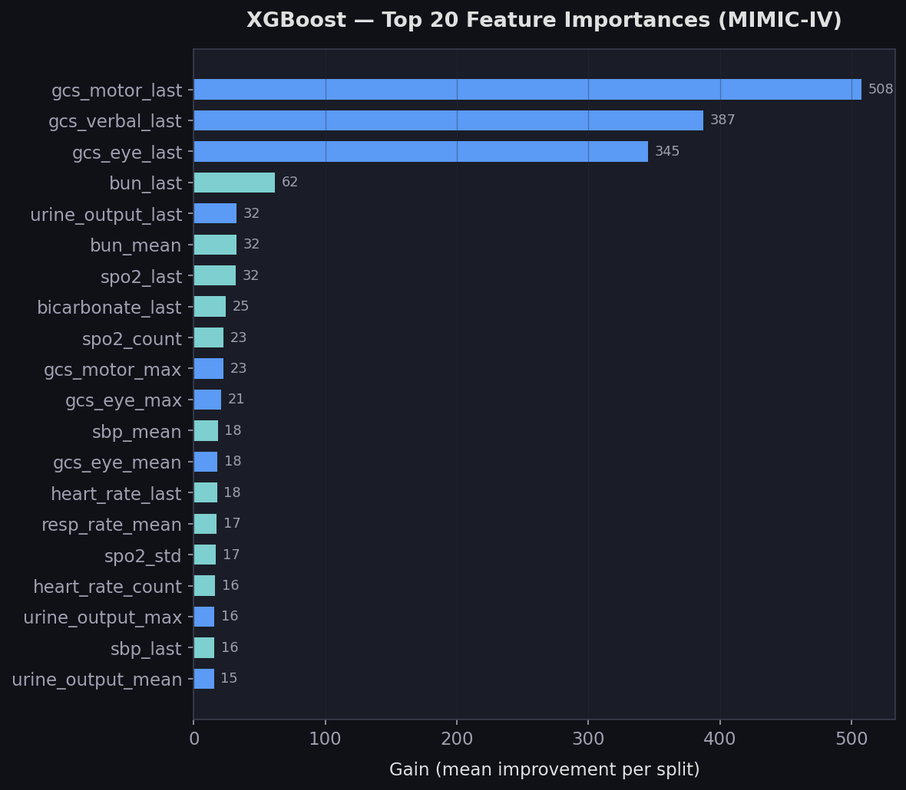
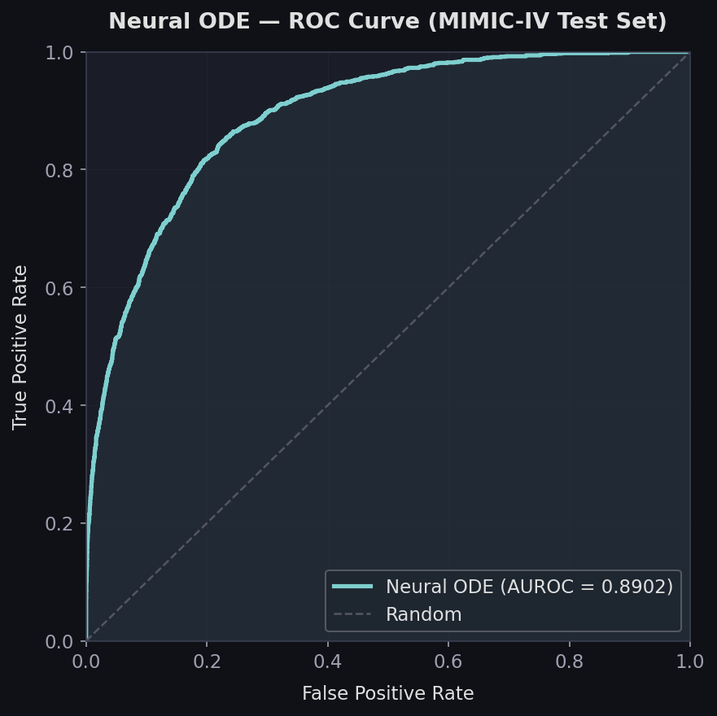

# Neural ODE for ICU Mortality Prediction

A systematic comparison of structured time-series models (XGBoost, Neural ODE), clinical NLP (ClinicalBERT), and multimodal fusion (GRU + BERT) for in-hospital mortality prediction on MIMIC-IV ICU data. All models evaluated on an identical canonical test set with bootstrap confidence intervals and DeLong significance testing. Includes a multi-task ClinicalBERT analysis that disentangles physiological mortality signal from code-status documentation confounds. Trained on MSU's Tempest HPC cluster.

## Motivation

ICU patient data is naturally irregular — vitals and labs are recorded at uneven intervals, and patients have vastly different observation patterns. Standard RNNs struggle with this. Neural ODEs model underlying continuous-time dynamics directly, making them a natural fit for clinical time series.

But does architectural sophistication actually help? And do clinical notes add independent information beyond what structured vitals capture — or do they primarily encode care-decision documentation like code status?

This project answers these questions through a rigorous head-to-head comparison across four model families, followed by a multi-task analysis that disentangles physiological mortality signal from care-decision confounds in clinical text.

---

## Results

### MIMIC-IV (Main Results)

All models evaluated on an identical canonical test set (n=4,715, 11.4% mortality) with 2,000-iteration bootstrap 95% confidence intervals and DeLong significance testing.

| Model | Test AUROC | 95% CI | Test AUPRC | 95% CI | Input |
|-------|-----------|--------|-----------|--------|-------|
| **XGBoost** | **0.9565** | [0.9473, 0.9644] | **0.8269** | [0.7976, 0.8524] | Structured vitals (20 vars, 160 features) |
| **Neural ODE** | **0.9039** | [0.8907, 0.9164] | **0.6661** | [0.6292, 0.7013] | Structured vitals (20 vars, hourly 48h) |
| Multimodal (GRU + BERT) | 0.8858 | [0.8720, 0.8992] | — | — | Structured vitals + clinical notes (frozen BERT) |
| BERT (notes) | 0.8809 | [0.8661, 0.8947] | 0.5387 | [0.4916, 0.5839] | First-48h nursing/physician notes |
| BERT multi-task | 0.8432 | — | 0.4552 | — | Notes + CMO/DNR auxiliary head |
| BERT multi-task (clean subgroup) | 0.8347 | — | 0.4077 | — | Notes, patients w/ low predicted CMO/DNR prob (<0.3) |

**Statistical significance:** All pairwise differences across the top four models are significant (non-overlapping CIs). XGBoost vs Neural ODE: DeLong z=11.22, p < 0.0001.

**Key findings:**
- Structured time-series models significantly outperform text-based approaches at every comparison
- Feature-engineered XGBoost (0.9565) dominates all neural approaches — careful statistical summaries of vitals capture more signal than continuous-time modeling or language models on this dataset
- Multimodal fusion (GRU + frozen BERT) marginally outperforms BERT alone (+0.005) but falls well short of Neural ODE on structured data alone — clinical notes add minimal complementary signal beyond what vitals already capture
- The performance hierarchy (XGBoost > Neural ODE > Multimodal > BERT) suggests that for short-horizon ICU mortality, temporal dynamics of vital signs are the primary signal, and text partially recapitulates what structured data already captures
- The BERT multi-task "clean subgroup" AUROC of 0.8347 is the most honest estimate of what clinical notes contribute from physiology alone, after removing the CMO/DNR confound (Section below)

#### ROC Curve Comparison (95% CI)


#### AUROC with Bootstrap 95% CI


#### XGBoost — Top 20 Feature Importances
GCS subscores dominate, consistent with clinical intuition — neurological status is the strongest predictor of ICU mortality.



#### Neural ODE — ROC Curve


---

### CMO/DNR Confound Analysis

Clinical notes contain a significant confounder: code status documentation. Phrases like "comfort measures only" or "DNR/DNI" strongly predict mortality but reflect care decisions, not physiological deterioration. A model exploiting this signal performs well retrospectively but offers no clinically actionable insight — a patient's care decision cannot be used to predict their mortality before that decision is made.

We address this with a **multi-task ClinicalBERT framework**:
- Shared Bio_ClinicalBERT encoder
- **Head A**: mortality prediction (primary task)
- **Head B**: CMO/DNR detection (auxiliary task, pseudo-labeled from notes via keyword matching — "comfort measures only," "DNR/DNI," "hospice," "withdrawal of care")
- Combined loss: `L = L_mortality + 0.3 * L_cmo`

Only 1.3% of training notes contain CMO/DNR keywords, yet the auxiliary head learns them easily (AUROC 0.9701).

**Results:**

| Analysis | Metric | Value |
|---|---|---|
| Correlation between mortality and CMO/DNR heads | Pearson r | **0.647** (p<0.001) |
| Auxiliary CMO/DNR head performance | AUROC | 0.9701 |
| Stratified: CMO/DNR-flagged patients (n=78, 65.4% mortality) | Mortality AUROC | 0.6601 |
| Stratified: non-CMO/DNR patients (n=4,637, 10.5% mortality) | Mortality AUROC | 0.8375 |
| **"Clean" subgroup (n=4,641, predicted CMO prob <0.3)** | **Mortality AUROC** | **0.8347** |

The mortality head partially exploits code status signal (r=0.647 ≈ 42% shared variance) but retains substantial independent information. The clean-subgroup AUROC of 0.8347 is the most honest estimate of what clinical notes contribute from physiology alone.

**Robustness:** A frozen-encoder training variant (BERT frozen 3 epochs, then unfrozen) produces consistent results (r=0.571, clean AUROC 0.8211), confirming the findings are not artifacts of a specific training configuration.

**BioMistral-7B LoRA (abandoned):** We initially attempted the multi-task analysis with BioMistral-7B using LoRA adapters (rank 16, alpha 32 on q/k/v/o projections, bfloat16). Training reached val AUROC 0.5992 after epoch 1 (2:43:55) and 0.7012 after epoch 2 (another 2:44:15) before the SLURM job was cancelled by wall-clock limit partway through epoch 3. For comparison, ClinicalBERT reached 0.88 val AUROC in ~15 minutes of wall time. The last-token representation used by decoder-only models appears poorly suited for clinical classification versus BERT's [CLS] token, and the throughput cost (~2s/iteration at batch size 1, gradient accumulation 4) made continued scaling impractical on a shared cluster. All multi-task experiments were therefore conducted with ClinicalBERT.

---

### PhysioNet 2012 (Initial Validation)

Initial experiments on the PhysioNet 2012 Challenge dataset (12k patients, 37 variables) confirmed the data-scale hypothesis.

| Model | Test AUROC | Test AUPRC |
|-------|-----------|-----------|
| XGBoost (367 features) | 0.8680 | 0.5626 |
| Neural ODE (best run) | 0.7464 | 0.4060 |
| 2012 Challenge winners | ~0.85 | — |

The gap between XGBoost and Neural ODE on 12k patients narrows substantially on MIMIC-IV (74k patients), confirming that Neural ODEs require more data to learn continuous-time dynamics effectively.

---

## Dataset

### MIMIC-IV (Primary)
- **74,829 ICU stays** (LOS >= 24h), MIMIC-IV v3.1
- **20 clinical variables**: heart rate, SBP, DBP, MBP, resp rate, temperature, SpO2, glucose, creatinine, sodium, potassium, hematocrit, WBC, bicarbonate, BUN, GCS motor/verbal/eye, urine output, age
- **Hourly binning**, 48-hour observation window, forward-fill imputation
- **11.9% mortality rate** (full dataset), **11.4%** (canonical test set)
- **Clinical notes**: 47,142 stays with nursing/physician notes (first 48h, discharge summaries excluded to prevent leakage)
- **Canonical split**: 80/10/10 stratified by mortality (seed=42) on the 47,142-stay intersection of structured and notes data
- Access via PhysioNet credentialed data use agreement

### PhysioNet 2012 (Initial)
- 12,000 ICU patients (sets A, B, C)
- 37 irregularly sampled clinical variables
- 13.9% mortality rate
- Open access: https://physionet.org/content/challenge-2012/1.0.0/

---

## Model Architectures

### Neural ODE (Latent ODE)

```
Observations (irregular) --> GRU Encoder (backwards) --> z0 ~ N(mean, var)
                                                               |
                                                     Neural ODE (dopri5)
                                                     dz/dt = MLP(z)
                                                               |
                                                     z_final (t = 48h)
                                                               |
                                                     Decoder --> Mortality logit
```

- **Encoder**: GRU processes `[values, mask]` pairs in reverse time order to produce a distribution over z0
- **Latent ODE**: `dz/dt = f(z)` solved via `dopri5` adaptive solver (torchdiffeq)
- **Reparameterization**: VAE-style sampling during training; mean used at inference
- **Loss**: BCE (pos_weight for class imbalance) + KL divergence on z0

### XGBoost
- 160 hand-crafted features: 8 per variable (mean, std, min, max, first, last, trend, count)
- Mask-aware extraction handles missing values natively

### ClinicalBERT (Notes)
- `emilyalsentzer/Bio_ClinicalBERT` fine-tuned on MIMIC-IV notes
- Input: concatenated first-48h nursing and physician notes (max 512 tokens)
- CLS token -> linear classifier

### ClinicalBERT Multi-task
- Shared Bio_ClinicalBERT encoder with two output heads
- **Head A**: mortality prediction (primary task)
- **Head B**: CMO/DNR detection (auxiliary, pseudo-labeled from note keywords)
- Combined loss: `L = L_mortality + 0.3 * L_cmo`
- Used for the CMO/DNR confound analysis in the Results section

### BioMistral-7B with LoRA (abandoned)
- `BioMistral/BioMistral-7B` (Llama-2-based, biomedical pretrained)
- LoRA rank 16, alpha 32, dropout 0.05 on q/k/v/o attention projections (~0.5% trainable params, 13.6M / 7.1B)
- bfloat16 inference, gradient accumulation 4 (effective batch 32)
- Abandoned: val AUROC 0.5992 (epoch 1) → 0.7012 (epoch 2, ~5.5h total wall time); epoch 3 cut short by SLURM time limit. ClinicalBERT reached 0.88 in ~15 minutes. Decoder-only last-token representation appears poorly suited for clinical classification compared to BERT's [CLS] token, and throughput made further scaling impractical.

### Multimodal Fusion (GRU + BERT)
- GRU encoder over structured time series (input dim 20, hidden 128, 2 layers) -> 64-dim latent
- ClinicalBERT over notes (frozen) -> 768-dim CLS token
- Concat (832-dim) -> FC(832->256) -> ReLU -> Dropout(0.5) -> FC(256->64) -> Dropout(0.3) -> FC(64->1)
- Differential learning rates: BERT 1e-5 (unused when frozen), GRU+head 1e-4
- Best val AUROC 0.8920 at epoch 22/25, no overfitting with frozen BERT

---

## Project Structure

```
neural-ode-icu/
├── src/
│   ├── model.py                       # GRUEncoder, ODEFunc, LatentODE
│   ├── dataset.py                     # PhysioNet 2012 data loading
│   ├── train.py                       # PhysioNet training loop
│   ├── baseline.py                    # XGBoost baseline (PhysioNet)
│   ├── clinicalbert/                  # PhysioNet ClinicalBERT pipeline
│   │   ├── serialize.py               # patient time series -> text
│   │   ├── model.py                   # ClinicalBERTClassifier
│   │   └── train_bert.py              # PhysioNet BERT training loop
│   ├── plot_baseline.py               # PhysioNet XGBoost plots
│   ├── plot_results.py                # PhysioNet Neural ODE plots
│   ├── plot_runs.py                   # PhysioNet training-curve plots
│   │
│   ├── mimic_preprocess.py            # MIMIC-IV preprocessing pipeline
│   ├── mimic_patch_features.py        # Add age + urine output to processed data
│   ├── mimic_dataset.py               # MIMIC-IV dataset class
│   ├── mimic_prep_notes.py            # Clinical notes preprocessing
│   │
│   ├── mimic_train_xgb.py             # XGBoost on MIMIC-IV
│   ├── mimic_train_ode.py             # Neural ODE on MIMIC-IV
│   ├── mimic_train_bert.py            # ClinicalBERT on serialized structured data
│   ├── mimic_train_bert_notes.py      # ClinicalBERT on clinical notes
│   ├── mimic_train_bert_multitask.py  # Multi-task ClinicalBERT (mortality + CMO/DNR)
│   ├── mimic_train_multimodal.py      # Multimodal fusion (GRU + BERT)
│   ├── mimic_train_lora.py            # BioMistral-7B LoRA fine-tuning (abandoned)
│   ├── mimic_train_lora_multitask.py  # Multi-task BioMistral LoRA (abandoned)
│   │
│   ├── mimic_create_split.py          # Canonical train/val/test split
│   ├── mimic_eval_xgb.py              # XGBoost evaluation on canonical split
│   ├── mimic_eval_ode.py              # Neural ODE evaluation on canonical split
│   ├── mimic_eval_bert_notes.py       # BERT evaluation on canonical split
│   ├── mimic_bootstrap_ci.py          # Bootstrap CIs + DeLong tests (all models)
│   │
│   ├── mimic_plot_xgb.py              # XGBoost plots
│   ├── mimic_plot_ode.py              # Neural ODE plots
│   └── mimic_plot_compare.py          # Multi-model comparison plots
│
├── tempest/                           # MSU Tempest HPC scripts
│   ├── baseline_hpc.py
│   ├── train_hpc.py
│   ├── setup.sh
│   ├── submit_baseline.sh
│   └── submit_train.sh
│
├── results/
│   ├── bootstrap_ci_results.json      # CIs and DeLong test results (XGBoost/ODE/BERT)
│   ├── xgboost_baseline.json          # XGBoost model dump
│   ├── plots/
│   │   ├── compare_roc_ci.png         # ROC curves with CI bands
│   │   ├── compare_summary_ci.png     # AUROC/AUPRC bar chart with CIs
│   │   ├── xgb_roc.png
│   │   ├── xgb_feature_importance.png
│   │   └── ode_roc.png
│   └── (Tempest HPC hosts multimodal / multi-task / LoRA predictions and logs)
│
├── data/                              # Not committed (credentialed access)
│   ├── mimic_iv_processed_v2.npz      # Structured data (74,829 x 48 x 20)
│   ├── mimic_iv_notes.npz             # Clinical notes (47,142 stays)
│   └── canonical_split.npz            # Fixed train/val/test indices
│
├── TRAINING_NOTES.md
└── requirements.txt
```

---

## Evaluation Pipeline

All models are evaluated through a standardized pipeline ensuring fair comparison:

1. **`mimic_create_split.py`** — Creates a single canonical 80/10/10 split on the intersection of structured and notes data (47,142 stays), stratified by mortality
2. **`mimic_eval_*.py`** — Evaluates each model on the canonical test set, saving predictions to `results/preds_*.npz`
3. **`mimic_bootstrap_ci.py`** — Computes 2,000-iteration bootstrap 95% CIs and pairwise DeLong significance tests across all models

This ensures every model is compared on identical patients with rigorous statistical testing.

---

## Training Infrastructure

All MIMIC-IV experiments were run on **MSU Tempest HPC**:
- GPU: NVIDIA A40 (48GB VRAM)
- Environment: PyTorch 2.5.1+cu121, torchdiffeq, transformers==4.44.2, peft==0.13.2
- Partition: `gpupriority` — account `priority-breschinecummins`
- Conda env: `neural-ode` (miniconda3)

Typical job submission:
```bash
sbatch --account=priority-breschinecummins --partition=gpupriority \
       --gres=gpu:1 --mem=48G --time=08:00:00 \
       --wrap="cd ~/neural-ode-icu && source ~/miniconda3/bin/activate neural-ode && python src/mimic_train_lora.py"
```

---

## Setup

```bash
pip install -r requirements.txt

# GPU (CUDA 12.x)
pip install torch --index-url https://download.pytorch.org/whl/cu121
pip install torchdiffeq transformers==4.44.2 xgboost scikit-learn

# For LoRA experiments
pip install peft==0.13.2 accelerate bitsandbytes
```

---

## Key Implementation Notes

- **Missing data**: Mask vector concatenated to encoder input — no imputation for Neural ODE; forward-fill for XGBoost/BERT
- **AMP disabled**: `torch.autocast` breaks dopri5's adaptive step-size controller. All Neural ODE training in fp32
- **BioMistral in bfloat16**: fp16 causes NaN overflow in Llama-family models; bfloat16 has the same exponent range as fp32
- **transformers pinned to 4.44.2**: Newer versions block `torch.load` on PyTorch < 2.6 (CVE-2025-32434)
- **peft pinned to 0.13.2**: Newer versions use `torch.distributed.tensor` unavailable in PyTorch 2.5.1
- **Notes leakage prevention**: Discharge summaries excluded via 48h time filter on `charttime`
- **Class imbalance**: `BCEWithLogitsLoss(pos_weight)` scaled to mortality rate per dataset
- **CMO/DNR pseudo-labels**: Keyword-matched from clinical notes (regex patterns for "comfort measures only," "DNR," "DNI," "hospice," etc.)

---

## References

- Rubanova, Y., Chen, T. Q., & Duvenaud, D. (2019). [Latent ODEs for Irregularly-Sampled Time Series.](https://arxiv.org/abs/1907.03907) *NeurIPS 2019.*
- Chen, T. Q., et al. (2018). [Neural Ordinary Differential Equations.](https://arxiv.org/abs/1806.07366) *NeurIPS 2018.* (Best Paper)
- Johnson, A., et al. (2023). MIMIC-IV: A freely accessible electronic health record dataset. *Scientific Data, 10*, 1.
- Alsentzer, E., et al. (2019). [Publicly Available Clinical BERT Embeddings.](https://arxiv.org/abs/1904.03323) *Clinical NLP Workshop @ NAACL.*
- Harutyunyan, H., et al. (2019). [Multitask learning and benchmarking with clinical time series data.](https://arxiv.org/abs/1703.07771) *Scientific Data, 6*, 96.
- Chen, T., & Guestrin, C. (2016). [XGBoost: A Scalable Tree Boosting System.](https://arxiv.org/abs/1603.02754) *KDD 2016.*
- Hu, E. J., et al. (2021). [LoRA: Low-Rank Adaptation of Large Language Models.](https://arxiv.org/abs/2106.09685) *ICLR 2022.*
- Deznabi, I., et al. (2021). [Predicting In-Hospital Mortality by Combining Clinical Notes with Time-Series Data.](https://aclanthology.org/2021.findings-acl.352) *ACL Findings.*
- Khadanga, S., et al. (2019). [Using Clinical Notes with Time Series Data for ICU Management.](https://arxiv.org/abs/1909.09702) *EMNLP 2019 Workshop on Health Text Mining.*

---

## Acknowledgments

Computing resources provided by the Tempest High Performance Computing System at Montana State University. MIMIC-IV data access granted through PhysioNet under a signed data use agreement. Dr. Bree Cummins provided research supervision and co-signed the PhysioNet DUA. AI-assisted tools (Claude, Anthropic) were used for code implementation, debugging, and analysis.
